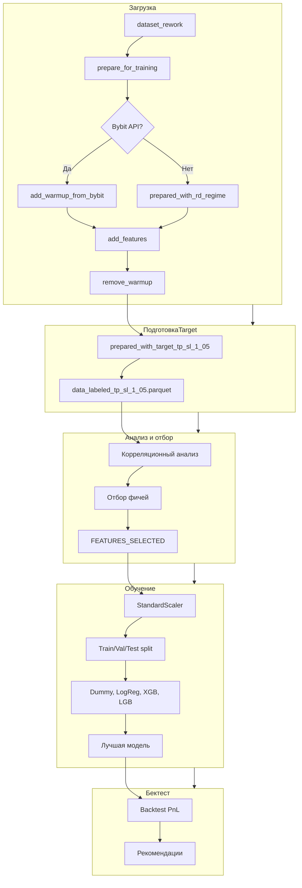

# План: Пайплайн фичей и моделей для tp_sl_1_05

## Цель

Использование финального target `tp_sl_1_05` (уже сохраненного в `outputs/prepared_with_target_tp_sl_1_05.parquet`) и полный пайплайн: подготовка данных для feature-этапа, корреляционный анализ, отбор фичей, стандартизация, обучение моделей, анализ и бектест на прибыльность.

---

## Список шагов

| Шаг | Описание | Артефакт |
|-----|----------|----------|
| 2 | Подготовка данных с финальным target | `outputs/data_labeled_tp_sl_1_05.parquet` |
| 3 | Корреляционный анализ фичей и target | `outputs/correlation_with_target_tp_sl_1_05.csv` |
| 4 | Отбор фичей: удаление шумных, мультиколлинеарных | `outputs/features_selected_tp_sl_1_05.txt` |
| 5 | Стандартизация и нормализация | `models/scaler_tp_sl_1_05.joblib` |
| 6 | Обучение и анализ моделей (Dummy, LogReg, XGB, LGB) | Модели, метрики AUC/F1 |
| 7 | Бектест на прибыльность | Net PnL, рекомендации |
| 8 | Итоговая документация | `docs/05_PIPELINE_CONCLUSIONS.md` |

---

## Схема потока данных

---

## Зависимости

- **fork:** `warmup_loader.py`, `feature_pipeline.py`, `data_prep_dataset_rework.py`, `dataset_rework_loader.py`
- **dataset_rework:** директория с CSV
- **outputs:** `prepared_with_target_tp_sl_1_05.parquet` (основной вход для 03_features)
